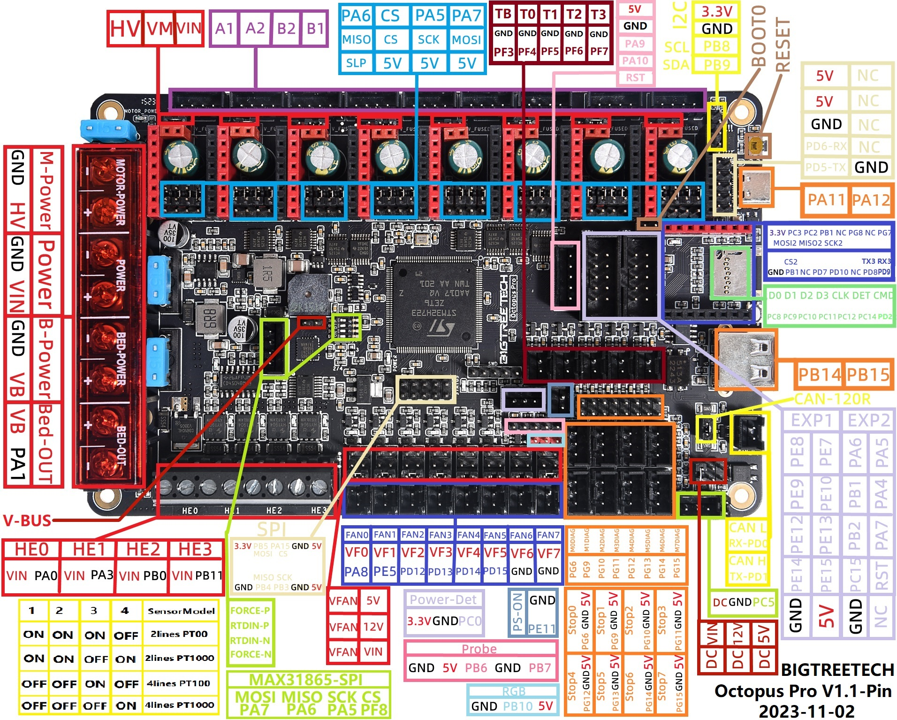
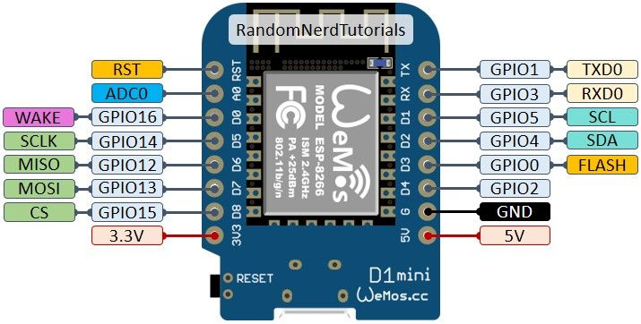

# grblHAL for BTT Octopus Pro v1.1 — Genmitsu 3020 Pro Max V2

> Custom grblHAL firmware for driving a Genmitsu 3020 Pro Max V2 CNC router
> with a BIGTREETECH Octopus Pro v1.1 (STM32H723ZET6), TMC2209 UART stepper
> drivers, 48 V spindle via SSR-40DD, opto-isolated probe input, WiFi WebUI
> via Wemos D1 Mini (ESP3D), and USB-C serial console for ioSender.
>
> Forked from [dresco/STM32H7xx](https://github.com/dresco/STM32H7xx).

---

## Why this project

The original Genmitsu 3020 Pro Max V2 control board failed and was no longer
available for purchase. Rather than sourcing a like-for-like replacement, this
conversion was designed with scalability in mind:

- **Spindle upgrade path** — the SSR-40DD relay and FAN4 wiring remain
  unchanged when swapping to a more powerful DC motor (just replace the PSU)
  or adding a VFD/PWM driver (update `my_machine.h` only, no rewiring)
- **Fourth axis / laser option** — MOTOR3–MOTOR7 slots are available for a
  rotary axis; PB6 (PROBE connector left pin) is reserved for a future 5 V TTL
  laser module with hardware PWM via TIM4_CH1
- **High-voltage stepper drivers** — the Octopus Pro can accept stepper drivers
  rated above 24 V (e.g. TMC5160 at 48 V DC), allowing NEMA17 motors to run at
  full bus voltage for higher speed and torque without changing the wiring
- **Open firmware** — grblHAL is actively maintained, supports Modbus VFD
  control, tool length probing, WebUI, and real-time overrides out of the box

---

## Table of Contents

1. [Setup overview](#setup-overview)
2. [Board reference](#board-reference)
3. [Complete pin map](#complete-pin-map)
4. [Hardware wiring diagrams](#hardware-wiring-diagrams)
5. [Octopus Pro jumper settings](#octopus-pro-jumper-settings)
6. [Building the firmware](#building-the-firmware)
7. [Flashing the board](#flashing-the-board)
8. [ESP3D setup on the Wemos D1 Mini](#esp3d-setup-on-the-wemos-d1-mini)
9. [ioSender setup](#iosender-setup)
10. [Initial grblHAL settings](#initial-grblhal-settings)
11. [Adding a laser later](#adding-a-laser-later)
12. [Troubleshooting](#troubleshooting)

---

## Setup overview

| Component | Choice | Notes |
|---|---|---|
| Controller board | BTT Octopus Pro v1.1 H723 | STM32H723ZET6, 25 MHz XTAL, 128 KB BTT bootloader |
| Stepper drivers | TMC2209 UART × 3 | X/Y/Z on MOTOR0/1/2 — jumpers set to UART mode |
| Main power supply | 48 V DC PSU | Powers the spindle |
| Logic/motor supply | Buck 48 → 24 V DC | Powers the board and motor driver inputs |
| Spindle | 48 V DC brushed motor, ON/OFF | Switched by SSR-40DD from FAN4 (24 V control) |
| Limit switches | Genmitsu original NC microswitches | 3-pin connectors (5V / GND / signal), `$5=7` set |
| Emergency stop | NC dual-pole button in series on power line | Hardware cut — no software pin, instant power-off |
| Probe / tool setter | Continuity clip + metal reference plate | On STOP5 (PG13), opto-isolated, 12 V tolerant |
| Board cooling fan | 12 V on FAN1 (PE5) | Controlled via M106 (on) / M107 (off) |
| PC console | USB-C → ioSender | Virtual COM port, 115200 baud |
| WiFi WebUI | Wemos D1 Mini + ESP3D | Wired to USART3 (PD8 / PD9) — WebUI served by ESP3D |
| Future | 5 V TTL laser module | PB6 (PROBE connector left pin) reserved |

### Intended use cases

- **CNC milling** — wood, aluminium, resins with DC spindle
- **PCB routing** — V-bit engraving with Z-probe for surface levelling and trace continuity
- **Laser engraving / cutting** (future, after adding a TTL 5 V laser module)

### Spindle design rationale

The spindle is intentionally wired as a simple ON/OFF output through the SSR-40DD relay:

- PCB routing always runs at full spindle speed; variable speed is not needed
- A more powerful spindle motor can be fitted by replacing only the PSU;
  the SSR relay, the FAN4 wiring, and this firmware all remain unchanged
- When a VFD or PWM motor controller is added in the future, only the plugin
  selection in `Inc/my_machine.h` and the physical wiring to the new controller
  need to change — the board map stays the same

### WebUI architecture

The WebUI is served **entirely by ESP3D running on the Wemos D1 Mini**. From
grblHAL's perspective, the Wemos is simply a device connected to USART3 that
forwards G-code commands over serial. No networking stack (lwIP, TCP/IP) runs
on the STM32 — only `SERIAL2_ENABLE=1` and `SDCARD_ENABLE=1` are required in
`my_machine.h`. This keeps the firmware lean and avoids Ethernet-related
dependencies that the Octopus Pro does not support onboard.

---

## Board reference

### BTT Octopus Pro v1.1 pinout



### Wemos D1 Mini pinout



---

## Complete pin map

### Quick reference table

| Function | MCU pin | BTT connector | Notes |
|---|---|---|---|
| **X STEP / DIR / EN** | PF13 / PF12 / PF14 | MOTOR0 | |
| **Y STEP / DIR / EN** | PG0 / PG1 / PF15 | MOTOR1 | Direction inverted: `$3=2` |
| **Z STEP / DIR / EN** | PF11 / PG3 / PG5 | MOTOR2_1 | MOTOR2_2 left empty |
| **X UART (TMC2209)** | PC4 | MOTOR0 MS3 pin | Single-wire UART; jumper in UART mode |
| **Y UART (TMC2209)** | PD11 | MOTOR1 MS3 pin | |
| **Z UART (TMC2209)** | PC6 | MOTOR2_1 MS3 pin | |
| **X LIMIT** | PG6 | STOP0 (J27) | NC microswitch, GND + signal + 5V (unused) |
| **Y LIMIT** | PG9 | STOP1 (J29) | NC microswitch |
| **Z LIMIT** | PG10 | STOP2 (J31) | NC microswitch |
| **PROBE** | PG13 | STOP5 | Opto-isolated, 12 V tolerant |
| **Spindle ENABLE (SSR)** | PD14 | FAN4 | Voltage-select jumper → 24 V |
| **Board cooling fan** | PE5 | FAN1 | Voltage-select jumper → 12 V; M106/M107 |
| **Emergency stop** | — | Power line (hardware) | NC dual-pole button, cuts all power |
| **Laser PWM** *(reserved)* | PB6 | PROBE left pin | TIM4_CH1 hardware PWM — unassigned |
| **ESP3D TX / RX** (MCU side) | PD8 / PD9 | USART3 | 115200 baud |
| **USB-C console** | PA11 / PA12 | USB-C | VCOM for ioSender |

### Block diagram

```
                     BIGTREETECH Octopus Pro v1.1
 ┌──────────────────────────────────────────────────────────────────┐
 │  MOTOR0 ─── TMC2209 ─── X axis  (STEP PF13, DIR PF12, EN PF14) │
 │  MOTOR1 ─── TMC2209 ─── Y axis  (STEP PG0,  DIR PG1,  EN PF15) │
 │                          Y direction inverted via $3=2           │
 │  MOTOR2 ─── TMC2209 ─── Z axis  (STEP PF11, DIR PG3,  EN PG5)  │
 │  MOTOR3..7 ─ empty (reserved for future axes / modules)         │
 ├──────────────────────────────────────────────────────────────────┤
 │  STOP0 (PG6)  ─── X limit  NC microswitch (GND + signal)        │
 │  STOP1 (PG9)  ─── Y limit  NC microswitch                       │
 │  STOP2 (PG10) ─── Z limit  NC microswitch                       │
 │  STOP5 (PG13) ─── probe / tool-setter  (12 V tolerant)          │
 ├──────────────────────────────────────────────────────────────────┤
 │  FAN4  (PD14) ─── SSR-40DD ─── 48 V DC spindle                  │
 │  FAN1  (PE5)  ─── board cooling fan (M106 on / M107 off)        │
 │  FAN0  (PA8)  ─── RESERVED  →  future laser PWM (TIM1_CH1)      │
 ├──────────────────────────────────────────────────────────────────┤
 │  USART3 PD8/PD9 ─── Wemos D1 Mini (ESP3D) ─── WiFi WebUI        │
 │  USB-C           ─── PC Windows ─── ioSender                    │
 └──────────────────────────────────────────────────────────────────┘
```

### Available expansion pins

| Pin | Connector | Suggested future use |
|---|---|---|
| PA8 (FAN0) | FAN0 | Laser PWM output (TIM1_CH1) |
| PD12 (FAN2) | FAN2 | LED lighting |
| PD13 (FAN3) | FAN3 | Free |
| PD15 (FAN5) | FAN5 | Free |
| PA0 (HE0) | HE0 | Coolant pump (high-current MOSFET) |
| PA3 (HE1) | HE1 | Air-blast solenoid (high-current MOSFET) |
| PB6 | PROBE left pin | Laser TTL 5 V PWM (TIM4_CH1) |
| PB7 | PROBE right pin | Secondary probe or reference sensor |
| STOP3/4/6/7 | J33/J34/J46… | Additional sensors, BLTouch, etc. |

---

## Hardware wiring diagrams

### Power distribution

```
  AC mains ─── 48 V DC PSU ─┬──► Spindle 48 V  (through SSR-40DD)
                             │
                             └──► Buck 48→24 V ─┬──► Octopus MOTOR_POWER (+/-)
                                                │
                                                └──► Octopus POWER (+/-)

                                                     (BED_POWER not used)
```

**Key points:**
- **Common ground**: the 48 V PSU, buck converter output, and Octopus board GND
  must all be joined. Without a common GND the SSR control signal has no
  reference and the spindle will not switch.
- **Buck converter current rating**: size it for at least 5 A at 24 V.
- **Spindle cable gauge**: AWG 16 / 1.5 mm² minimum for the 48 V lines.

### Emergency stop

```
  AC mains ──── E-STOP (NC dual-pole) ──── PSU ──► everything
```

The NC dual-pole button is wired in series on the mains input (or on the 48 V
DC line after the PSU, depending on your layout). When pressed, all power to
the machine is cut instantly — motors, spindle, and controller board all lose
power simultaneously. No firmware support is needed or used.

> **Safety note:** the E-stop button must be accessible without reaching over
> the work area. Mount it on the front or side of the enclosure.

### Spindle via SSR-40DD

```
  Octopus FAN4 connector:
       ┌─ VF4 (voltage-select jumper → 24 V) ─── (+) SSR control input  (3–32 V DC)
       └─ GND                                 ─── (−) SSR control input

  SSR-40DD load side:
       (+) 48 V ─────────────────────────────── (+) spindle motor
       (−) 48 V ── SSR internal switch ───────── (−) spindle motor
                   (open when SSR is OFF)
```

G-code: `M3 S1` → spindle ON,  `M5` → spindle OFF.
The S-value is ignored since there is no PWM — the SSR switches fully on or off.

### Board cooling fan

```
  Octopus FAN1 connector:
       ┌─ VF1 (voltage-select jumper → 12 V) ─── (+) fan
       └─ GND                                 ─── (−) fan
```

G-code: `M106` → fan ON,  `M107` → fan OFF.
Requires `$386` to be set after first flash — see [Initial grblHAL settings](#initial-grblhal-settings).

### Limit switches (NC microswitches, 3-pin connectors)

```
  STOP0 connector (J27):
       ┌─ 5 V    (leave unconnected — not used)
       ├─ GND ───── COM terminal of the microswitch
       └─ PG6 ───── NC terminal of the microswitch

  Same wiring for STOP1 (Y / J29) and STOP2 (Z / J31).
```

NC wiring: at rest the switch is closed, so PG6 is pulled LOW through the switch.
When the axis reaches the endstop, the switch opens → pin goes HIGH → limit fires.
grblHAL internal pull-up is active on all limit pins.
This requires `$5=7` (invert all three limit inputs) — see [settings](#initial-grblhal-settings).

### Probe / tool setter

```
           ┌──── alligator clip on the tool shank (clipped to the collet)
           │
           ▼
   ┌──────────────┐        STOP5 connector:
   │  end mill    │         ┌─ 5 V   (leave unconnected)
   └──────┬───────┘         ├─ GND ── second alligator clip wire
          │ touches         └─ PG13 ─ first alligator clip wire
   ───────▼──── metal reference plate on workpiece
```

When the tool touches the plate, continuity closes, PG13 is pulled to GND,
and grblHAL fires the probe trigger. The signal passes through an onboard
EL357C opto-coupler — tolerates up to 12 V on the signal line without damage.

Enable the probe in firmware: uncomment `#define PROBE_ENABLE 1` in
`Inc/my_machine.h` and rebuild.

### Wemos D1 Mini (ESP3D WebUI)

```
   Wemos D1 Mini                    Octopus Pro
   ┌──────────────┐                 ┌──────────┐
   │  5 V ────────┼── 5 V ──────────┤ any 5 V breakout pin
   │  GND ────────┼── GND ──────────┤ GND
   │  TX  (GPIO1) ┼── wire ─────────┤ PD9  (USART3 RX)
   │  RX  (GPIO3) ┼── wire ─────────┤ PD8  (USART3 TX)
   └──────────────┘                 └──────────┘
```

TX/RX crossover: transmit of one side connects to receive of the other.

> **Note:** ESP3D on the Wemos acts as a WiFi-to-serial bridge and serves the
> WebUI itself. grblHAL sees the Wemos as a plain serial device on USART3 —
> no networking stack runs on the STM32.

---

## Octopus Pro jumper settings

### Motor power voltage jumpers

> **Set ALL motor slot jumpers (MOTOR0–MOTOR7) to the RIGHT side (POWER = 24 V).**

Do not use the MOTOR_POWER (high-voltage) side unless you intentionally run
motors above 24 V. TMC2209 supports up to 29 V; 24 V gives good thermal margin.

### FAN voltage-select jumpers

| Connector | Setting | Reason |
|---|---|---|
| FAN1 (board cooling fan) | **12 V** | Fan rated 12 V, controlled via M106/M107 |
| FAN4 (spindle enable) | **24 V** | SSR-40DD control input; 24 V is most reliable |
| FAN0 (future laser) | **5 V** | Set when you wire the laser module |
| Others | leave as-is | Not used in this build |

### StallGuard / DIAG jumpers

We use physical NC microswitches for homing. **Leave all DIAG jumpers unplugged.**

### MCU power jumper (near USB-C)

| Situation | State |
|---|---|
| Normal CNC operation | **Removed** — board powered from POWER input |
| DFU flash via USB-C only | **Inserted** — main supply must be OFF |

---

## Building the firmware

### Option A — Web builder (no installation required)

1. Open **http://svn.io-engineering.com:8080/**
2. Processor: **STM32H7xx** — Board: **BTT Octopus Pro (H723)**
3. Driver: **TMC2209**
4. Plugins: **SD card**, **EEPROM**, enable **Serial2**, **Fans**
5. Click **Generate** → extract `firmware.bin` from the downloaded zip

> **Limitation:** the web builder uses the upstream dresco board map. Use
> Option B for fully customised builds (fan on FAN1, probe on STOP5, etc.).

### Option B — PlatformIO (recommended for custom builds)

**Prerequisites (install once):**
1. [Visual Studio Code](https://code.visualstudio.com/)
2. **PlatformIO IDE** extension (VSCode marketplace)
3. [Git for Windows](https://git-scm.com/download/win)

**Build:**

```bash
git clone --recursive https://github.com/zinoalex/grblHAL-OctopusPro-3020Max.git
cd grblHAL-OctopusPro-3020Max
pio run -e octopus_pro_3020max
```

Output: `.pio/build/octopus_pro_3020max/firmware.bin`

### Option C — GitHub Actions (cloud build)

Every push to `master` automatically compiles the firmware. Download it from
the **Actions** tab → latest green run → **Artifacts** section.

---

## Flashing the board

### Method 1 — SD card (recommended)

```
1. Format a microSD (≤32 GB) as FAT32 using https://www.sdcard.org/downloads/formatter/
2. Copy the binary to the SD root, named exactly: firmware.bin
3. Power off the board.
4. Insert the SD into the TF card slot.
5. Power on. Wait ~10 seconds (STATUS LED blinks during flash).
6. Power off, remove SD, power back on.
7. Verify: firmware.bin has been renamed to FIRMWARE.CUR on the SD card.
```

### Method 2 — DFU via USB-C

> ⚠️ DFU overwrites the bootloader. Re-flash the BTT 128 KB bootloader
> afterwards to restore SD-card update capability.

```
1. Power off the main supply.
2. Insert the MCU Power jumper (near USB-C).
3. Hold BOOT0, press+release RESET, release BOOT0.
4. Run:  pio run -e octopus_pro_3020max -t upload
5. Remove the MCU Power jumper.
```

---

## ESP3D setup on the Wemos D1 Mini

### Flashing ESP3D

```bash
pip install esptool
esptool.py --chip esp8266 --port COMx --baud 460800 \
  write_flash --flash_size detect 0x0 ESP3D-3.x.x-ESP8266.bin
```

Download the binary from https://github.com/luc-github/ESP3D/releases

### First-time configuration

1. The Wemos creates a WiFi AP named `ESP3D` (password: `12345678`)
2. Connect to it and open `http://192.168.0.1`
3. **Settings → Network**: mode = **STA**, enter your WiFi credentials
4. **Settings → Serial**: baud rate = **115200**, flow control = **None**
5. Save and restart — the Wemos connects to your router on every boot

Find the assigned IP from your router's admin page, then open
`http://<wemos_ip>` to access the WebUI.

> The WebUI and all file serving run on the Wemos/ESP3D. The STM32 firmware
> only needs to keep USART3 open at 115200 baud to exchange G-code with it.

---

## ioSender setup

1. Connect Octopus Pro to PC via USB-C (main power already on, no MCU jumper)
2. In Windows **Device Manager → Ports (COM & LPT)**, note the COM number
3. Open ioSender → **Settings → Comms**: Port = `COMx`, Baud = **115200**, Handshake = **None**
4. Click **Connect**

grblHAL starts in alarm state — type `$X` to unlock, or `$H` to home.

---

## Initial grblHAL settings

These settings are verified on the Genmitsu 3020 Pro Max V2 and reflect actual
measured operation. Paste them in the ioSender console.

```gcode
; Steps per mm — verified on this machine
$100=800.000
$101=800.000
$102=800.000

; Maximum feed rates (mm/min)
$110=2500.000
$111=2500.000
$112=600.000

; Accelerations (mm/sec²)
$120=250.000
$121=250.000
$122=100.000

; Maximum travel / soft limits (mm)
$130=300.000
$131=200.000
$132=60.000

; Limit switch logic — NC microswitches require inversion
$5=7

; Hard limits and soft limits
$21=1
$20=1

; Axis direction inversion — Y axis mechanically inverted
$3=2

; Homing
$23=3
$22=1
$25=500.000
$24=50.000
$27=5.000

; Spindle (ON/OFF only — no PWM)
$30=1000
$31=0
$32=0

; TMC2209 motor current (mA RMS) — safe starting point for NEMA17
$338=7
$200=800
$201=800
$202=800
```

### Fan port assignment (first flash only)

The fans plugin assigns the physical pin at runtime via the ioports system.
After the first flash you must map the correct aux output port to Fan 0:

```
1. In ioSender console, run:  $pins
2. Find the output line showing PE5 — note its aux port number (e.g. "Aux out: 1")
3. Set $386 to that number, e.g.:  $386=1
4. Hard reset the board (power cycle or $RST=*)
5. Test: M106 turns the fan on, M107 turns it off
```

> This setting is stored in non-volatile memory and survives power cycles.
> It only needs to be set once unless you reflash and erase settings.

---

## Adding a laser later

### Hardware

Wire the laser TTL input to **PB6** — the left signal pin of the PROBE/BLTouch
connector (J43) on the Octopus Pro. PB6 supports hardware PWM via TIM4_CH1.

```
  Octopus PROBE connector (J43)
  ┌─────────────────┐
  │ GND ────────────┼── Laser GND
  │ 5 V ────────────┼── Laser VCC (if 5 V powered; otherwise use separate supply)
  │ PB6 ────────────┼── Laser TTL PWM input
  │ GND │           │
  │ PB7 │ (unused)  │
  └─────────────────┘
```

The laser power supply (12 V or higher) must share GND with the Octopus board.

### Firmware changes

In `boards/btt_octopus_pro_map.h`, add after the AUXOUTPUT7 block:

```c
#define AUXOUTPUT8_PORT             GPIOB   // PB6 — laser PWM (TIM4_CH1)
#define AUXOUTPUT8_PIN              6
```

Change the `SPINDLE_PWM` guard to:

```c
#if DRIVER_SPINDLE_ENABLE & SPINDLE_PWM
#define SPINDLE_PWM_PORT            AUXOUTPUT8_PORT
#define SPINDLE_PWM_PIN             AUXOUTPUT8_PIN
#endif
```

In `Inc/my_machine.h`, enable:

```c
#define SPINDLE0_ENABLE         SPINDLE_PWM0
```

Rebuild, re-flash, then in ioSender:

```gcode
$32=1       ; laser mode ON
$30=1000    ; max power = 100% duty cycle
```

Use `M4 S<power>` for dynamic power (recommended for cutting paths).

---

## Troubleshooting

### Board not detected as COM port

- Check the MCU Power jumper is **not** inserted during normal use
- Try a different USB-C cable (many are charge-only, no data)
- Install the STM32 Virtual COM driver: https://www.st.com/en/development-tools/stsw-stm32102.html

### firmware.bin not loaded from SD card

- Format the SD with the [official SD Formatter](https://www.sdcard.org/downloads/formatter/)
- File must be named **exactly** `firmware.bin` in the SD root
- After successful flash it will be renamed to `FIRMWARE.CUR`

### TMC communication error at startup

- Verify UART-mode jumpers under each TMC2209 (BTT manual section 3.2)
- Set `$338=7` (only XYZ drivers declared)
- Try `$339=500` to increase the startup delay
- Run `M122` to read driver status registers

### Homing does not trigger (axis crashes into endstop)

- Check `$5=7` is set (NC microswitches require inversion)
- In ioSender, watch the **Limit pins** indicator while manually pressing
  each microswitch — it should show the pin changing state
- If the indicator shows the pin as already triggered at rest, the wiring or
  `$5` value is wrong

### Y axis moves in the wrong direction

- Confirm `$3=2` is set (Y direction inverted)
- If X also moves backwards, use `$3=3` (both X and Y inverted)

### Fan does not respond to M106 / M107

- Verify `$386` is set to the correct aux port number for PE5 (run `$pins` to check)
- A hard reset is required after changing `$386`
- Verify the FAN1 voltage-select jumper is set to 12 V

### Wemos keeps disconnecting

- Check for power instability: ESP8266 draws up to 300 mA peak during TX
- Use short wires from the 5 V breakout pin
- Avoid placing the Wemos inside a metal enclosure

### WebUI not reachable

- Verify ESP3D serial baud rate is 115200 (must match grblHAL USART3)
- Check TX/RX crossover: Wemos TX → Octopus PD9 (RX), Wemos RX → Octopus PD8 (TX)
- The WebUI is served by the Wemos — connect to the Wemos IP, not the board

### SD files not visible in WebUI

- Verify `SDCARD_ENABLE=1` is active at build time
- Check that `OVERRIDE_MY_MACHINE` is **not** defined in `platformio.ini`

---

## License

Inherits **GPL v3** from the upstream grblHAL project. See [COPYING](COPYING).

## Credits

- [grblHAL](https://github.com/grblHAL) — Terje Io and contributors
- [dresco/STM32H7xx](https://github.com/dresco/STM32H7xx) — H7 port this fork is based on
- [BIGTREETECH](https://github.com/bigtreetech) — Octopus Pro hardware
- [luc-github/ESP3D](https://github.com/luc-github/ESP3D) — Wemos firmware

## Useful links

- [BTT Octopus Pro schematic and pin map](https://github.com/bigtreetech/BIGTREETECH-OCTOPUS-Pro)
- [grblHAL wiki](https://github.com/grblHAL/core/wiki)
- [grblHAL $ settings reference](https://github.com/grblHAL/core/wiki/grblHAL-settings)
- [ioSender releases](https://github.com/terjeio/ioSender/releases)
- [ESP3D releases](https://github.com/luc-github/ESP3D/releases)